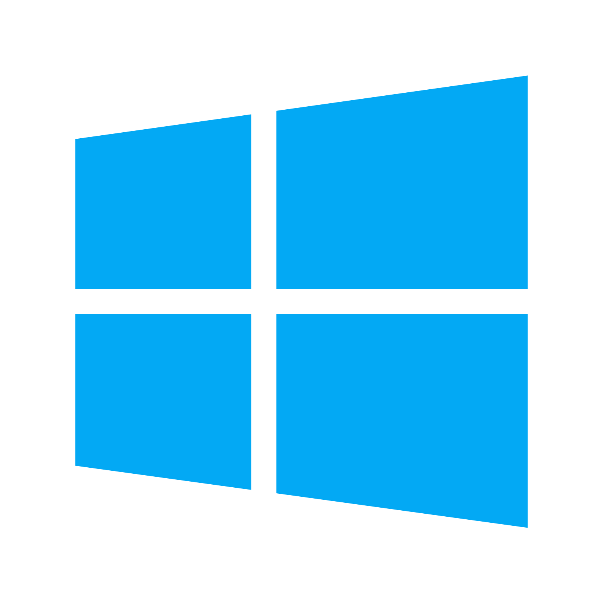
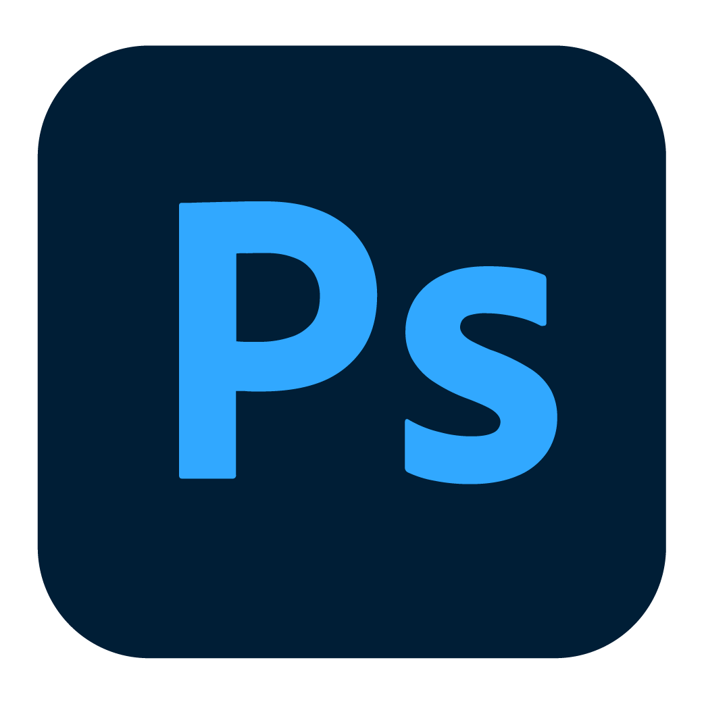
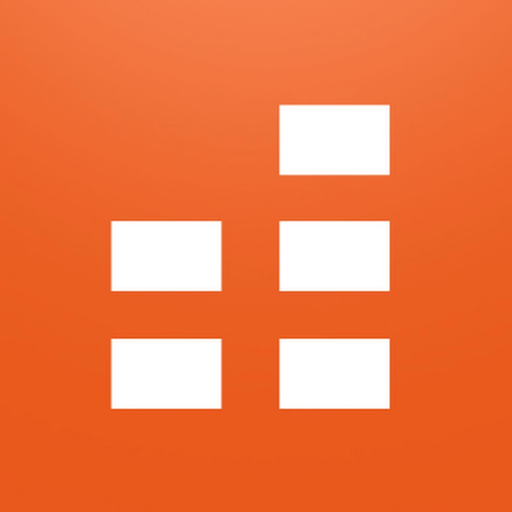

## Hey, my name is Adalbert 

### and I'm a developer & musician!

- 🔎 I’m currently learning C++ & Arduino
- ⚡ My hobbies: I like drawing, playing musical instruments, playing sports and programming
- 🥅 2022 Goals: That's a good question.. (🟠)

---

### 👀 My Projects (I'm currently working on)

I'm not working on any bigger projects at the moment.

---

### Languages and Tools:

   

   

   

---

 
  
  
 
  
  
 
  

 

---
